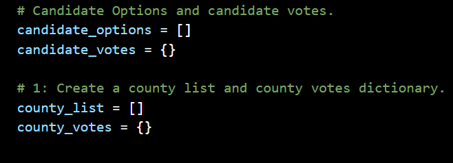
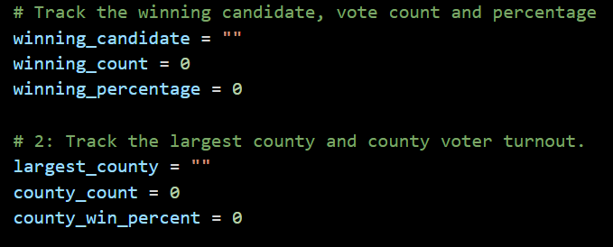
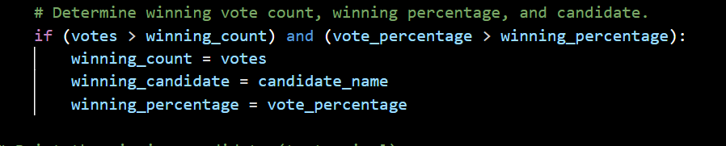

# Election_AnalysisWASHU
## Washu Python

## Overview of Election Audit
The election commission wants a detailed list of information on the election. This data will help the commission understand total votes for each region and candidates.

## Election-Audit Results
How many votes were cast in this congressional election?
- 396,711

Provide a breakdown of the number of votes and the percentage of total votes for each county in the precinct.
- Jefferson had 38,855 votes. This represented 10.5% of the votes.
- Denver had 306,055 votes. This represented 82.8% of the votes.
- Arapahoe had 24,801 votes. This represented 6.7% of the votes.

Which county had the largest number of votes?
- Denver

Provide a breakdown of the number of votes and the percentage of the total votes each candidate received.
- Charles Casper Stockham had 85,213 votes. This represented 23.0% of the votes.
- Diana DeGette had 272,892 votes. This represented 73.8% of the votes.
- Raymon Anthony Doane had 11,606 votes. This represented 3.1% of the votes.

Which candidate won the election, what was their vote count, and what was their percentage of the total votes?
- Diana DeGette won the election. 
- Her vote count was 272,892 votes. 
- Her vote percentage was 73.8%.

## Election-Audit Summary
This script can track other candidates and counties at other elections. This election we used lists and dictionaries to track the candidates and counties. 
 
 
 
We used variables to track the winner for candidates and county. 
 

We can use these same lists, dictionaries, and variables to track any election if given the correct information. Now say you want the last place candidate or counties with less than 5% of the votes. We would modify the data below: 
 
 
 

By modifying these two parts of the program we can use statistical analysis when looking at votes by county or candidate or age group. Say we wanted to look at age group of the voters. We can modify the lists, dictionaries, and variables so we can track what ages showed up to vote. With this information, we can see a small or strong presence. If there was a bad showing of young adults, we can ask why. Maybe it was during school when they couldn’t vote.  This program is a powerful tool which can be used to get information so the election is being utilized to its fullest potential. 
