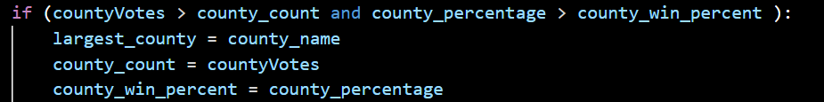

# Election_AnalysisWASHU
## Washu Python

## Overview of Election Audit: Explain the purpose of this election audit analysis.
The election commission wants a detailed list of information on the election. This data will help the commission understand total votes for each region and candidates.

How many votes were cast in this congressional election?
- 396,711

Provide a breakdown of the number of votes and the percentage of total votes for each county in the precinct.
- Jefferson had 38,855 votes. This represented 10.5% of the votes.
- Denver had 306,055 votes. This represented 82.8% of the votes.
- Arapahoe had 24,801 votes. This represented 6.7% of the votes.

Which county had the largest number of votes?
- Denver

Provide a breakdown of the number of votes and the percentage of the total votes each candidate received.
- Charles Casper Stockham had 85,213 votes. This represented 23.0% of the votes.
- Diana DeGette had 272,892 votes. This represented 73.8% of the votes.
- Raymon Anthony Doane had 11,606 votes. This represented 3.1% of the votes.

Which candidate won the election, what was their vote count, and what was their percentage of the total votes?
- Diana DeGette won the election. 
- Her vote count was 272,892 votes. 
- Her vote percentage was 73.8%.

## Summary
This script can track different things other than this specific election. This election we used lists and dictionarys to track the candidates and counties. 
 
 
We used variables to track the winner for candidates and county. 

Now we can use these same lists, dictionaries, and variables to track any election if given the correct information. Now say you want the last place candidate or counties with less than 5% of the votes. We would modify the data below: 
 

By modifing these two parts of the program we can use statistical analysis when looking at votes by county or candidate or age group. We could track what age of voters cast a vote and see what the younger generation is concerned about. This is a power tool which can be used to get information so the best decisions can made for the general public. 
